# CANFAR Platform Concepts

**Understanding the architecture and core concepts behind the CANFAR Science Platform for astronomical research.**

!!! abstract "🎯 Core Concepts"
    **Essential platform knowledge for all users:**
    
    - **Cloud Architecture**: Container-based platform design
    - **Container Environments**: Pre-built software stacks for astronomy
    - **Session Management**: Interactive and batch computing resources
    - **Storage Systems**: Data persistence and collaboration
    - **Browser Access**: Minimal-installation web-based workflows


## 🚀 CANFAR Science Platform Overview

The **Canadian Advanced Network for Astronomy Research (CANFAR)** Science Platform is a cloud-native computing environment designed specifically for astronomical research workflows.

### Platform Design Philosophy

CANFAR eliminates traditional barriers to astronomical computing:

- **Minimal Software Installation**: Pre-built environments with astronomy packages ready to use
- **Browser-Based Access**: Complete workflows accessible through web interfaces
- **Scalable Resources**: Computing power that grows with your project needs
- **Collaborative Infrastructure**: Shared storage and standardised environments
- **Reproducible Science**: Container-based workflows ensure consistent results

### Core Benefits

=== "Individual Researchers"
    - **Minimal Setup**: Pre-configured containers ready to use immediately
    - **Hardware Liberation**: Access powerful computing without owning servers
    - **Location Independence**: Work from anywhere with just a web browser
    - **Data Protection**: Automatic backups and managed storage systems

=== "Research Teams"
    - **Environment Standardisation**: Identical software stacks across the team
    - **Seamless Collaboration**: Shared workspaces and data access
    - **Session Sharing**: Live collaboration on analysis workflows
    - **Project Management**: Centralised resource and permission management

=== "Large Projects"
    - **Dynamic Scaling**: Resources adjust to computational demands
    - **Batch Processing**: Automated workflows for large dataset processing
    - **Custom Environments**: Specialised containers for unique requirements
    - **Archive Integration**: Fast access to astronomical data repositories

## 🏗️ Platform Architecture

CANFAR is built on modern cloud-native technologies designed for scalability, reliability, and ease of use. Understanding the architecture helps you leverage the platform effectively.

### System Components

```mermaid
graph LR
    %% User Entry Point
    User["👤 Scientist"]:::user
    
    %% Portal Layer
    Portal["🌐 Science Portal<br/>canfar.net"]:::portal
    Auth["🔐 CADC Authentication"]:::auth
    Sessions["🖥️ Session Manager<br/>Skaha"]:::sessions
    
    %% Infrastructure Layer
    K8s["☸️ Kubernetes Cluster"]:::k8s
    Containers["🐳 Container Images<br/>Harbor Registry"]:::containers
    Storage["💾 Storage Systems"]:::storage
    
    %% Storage Systems
    arc["📁 arc POSIX Storage<br/>Shared Filesystem"]:::arc
    vault["☁️ VOSpace Object Store<br/>Long-term Storage"]:::vospace
    scratch["⚡ Scratch<br/>Temporary SSDs"]:::scratch
    
    %% Session Types
    Types["Session Types"]:::types
    Notebook["📓 Jupyter Notebooks"]:::notebooks
    Desktop["🖥️ Desktop Environment"]:::desktop
    CARTA["📊 CARTA Viewer"]:::carta
    Firefly["🔥 Firefly Viewer"]:::firefly
    Contrib["⚙️ Contributed Apps"]:::contrib
    Batch["🏭 Batch Jobs"]:::batch
    
    %% Connections
    User --> Portal
    Portal --> Auth
    Portal --> Sessions
    
    Auth --> K8s
    Sessions --> K8s
    
    K8s --> Containers
    K8s --> Storage
    
    Storage --> arc
    Storage --> vault
    Storage --> scratch
    
    Sessions --> Types
    Types --> Notebook
    Types --> Desktop
    Types --> CARTA
    Types --> Firefly
    Types --> Contrib
    Types --> Batch
    
    %% Styling
    classDef user fill:#e3f2fd,stroke:#1976d2,stroke-width:3px,color:#000
    classDef portal fill:#f3e5f5,stroke:#7b1fa2,stroke-width:2px,color:#000
    classDef auth fill:#ffebee,stroke:#c62828,stroke-width:2px,color:#000
    classDef sessions fill:#e8f5e8,stroke:#2e7d32,stroke-width:2px,color:#000
    classDef k8s fill:#fff3e0,stroke:#ef6c00,stroke-width:3px,color:#000
    classDef containers fill:#f1f8e9,stroke:#558b2f,stroke-width:2px,color:#000
    classDef storage fill:#e0f2f1,stroke:#00695c,stroke-width:2px,color:#000
    classDef arc fill:#fce4ec,stroke:#ad1457,stroke-width:2px,color:#000
    classDef vospace fill:#f3e5f5,stroke:#6a1b9a,stroke-width:2px,color:#000
    classDef scratch fill:#fff8e1,stroke:#f57f17,stroke-width:2px,color:#000
    classDef types fill:#e1f5fe,stroke:#0277bd,stroke-width:2px,color:#000
    classDef notebooks fill:#f3e5f5,stroke:#7b1fa2,stroke-width:2px,color:#000
    classDef desktop fill:#e8f5e8,stroke:#388e3c,stroke-width:2px,color:#000
    classDef carta fill:#fff3e0,stroke:#f57c00,stroke-width:2px,color:#000
    classDef firefly fill:#fce4ec,stroke:#c2185b,stroke-width:2px,color:#000
    classDef contrib fill:#e0f2f1,stroke:#00695c,stroke-width:2px,color:#000
    classDef batch fill:#ffebee,stroke:#d32f2f,stroke-width:2px,color:#000
```



### Architecture Components

**Browser-Based Portal** (`canfar.net`)
:   Single entry point to the platform - usually no software installation required. Provides access to all CANFAR services through web interfaces.

**Authentication System** (CADC / OIDC)
:   Secure identity management through the Canadian Astronomy Data Centre, providing single sign-on and access control across astronomical data archives and user-created group management

**Container Orchestration** (kubernetes)
:   Manages computing resources automatically, handling container deployment, scaling, and resource allocation behind the scenes.

**Software Environments** (Harbor Registry)
:   Pre-built and customised container images with astronomy software packages, from basic Python environments to specialised tools like CASA and CARTA.

**Session Management** (`skaha`)
:   Orchestrates your computing sessions, connecting containers with storage systems and managing resource allocation.

**Storage Infrastructure**
:   Multiple storage systems optimised for different use cases - from high-performance computing to long-term archival.

### Key Architectural Principles

**Container-First Design**
:   All software runs in containers, ensuring consistency, reproducibility, and easy distribution of complex software environments.

**Kubernetes-Native**
:   Built on Kubernetes for automatic scaling, resource management, and high availability without manual intervention.

**Storage Separation**
:   Data persistence is handled separately from computing, allowing containers to be ephemeral while keeping your data safe.

**Web-Based Access**
:   Everything accessible through standard web browsers for portability and ease of installation.

**API-Driven**
:   All platform functions available through REST APIs, enabling automation and integration with external tools.

!!! info "For Developers"
    The platform provides REST APIs for programmatic access. See the **[CANFAR Python Client](../client/home.md)** for automation and scripting examples.


## 🐳 Container Environments

Containers are the foundation of CANFAR's flexibility and reproducibility. They provide complete, portable software environments with all astronomy tools pre-configured and ready to use.

### Container Fundamentals

**What are Containers?**
:   Lightweight, portable packages that include an application and all its dependencies (libraries, tools, system settings) in a single, consistent environment.

**Why Containers for Astronomy?**
:   Solve the traditional "dependency hell" of astronomical software by packaging complex tool chains into reproducible, shareable environments.

### Traditional vs Container Workflows

=== "Traditional Software Installation"
    **Common Problems:**
    
    - Conflicting library versions and dependencies  
    - Missing system requirements and packages
    - Different behaviour across different machines
    - Time-consuming setup and configuration
    - Version compatibility issues between tools
    - "It works on my machine" syndrome

=== "Container Approach"
    **Solutions Provided:**
    
    - Consistent environment that works identically everywhere
    - All dependencies pre-installed and tested together
    - No installation or configuration required
    - Easy sharing and collaboration
    - Reproducible analysis results
    - Instant access to complex software stacks

### Popular CANFAR Containers

| Container | Purpose | Key Software | Best For |
|-----------|---------|--------------|----------|
| **astroml** | General astronomy analysis | scipy, astropy, matplotlib, pandas, scikit-learn, pytorch, STILTS | Data analysis, visualization, ML, research |
| **improc** | Image processing | CASUTools, SExtractor, SWarp, IRAF, STILTS | Photometry, astrometry, source detection, PSF fitting |
| **casa** | Radio/MM astronomy | CASA software suite, Python | Radio astronomy, interferometry |
| **lsst** | LSST Analysis | LSST Software Stack | Image processing, LSST software stack and data access |
| **carta** | Data visualization | CARTA viewer, analysis tools | Interactive datacubes visualization |

!!! tip "Container Selection"
    **Start with `astroml`** for general astronomy work - it includes most common packages and is regularly updated with the latest astronomy and machine learning software.

### Container Lifecycle & Performance

**First Launch** (2-3 minutes)
:   kubernetes downloads the container image to node-local storage. This only happens once per container type.

**Subsequent Launches** (30-60 seconds)
:   Fast startup using cached images. Container starts with your storage systems already connected.

**During Session**
:   Full access to pre-configured software environment with your data mounted and ready to use.

**Session End**
:   Container is destroyed, scratch is wiped out, but all data in persistent storage remains safely preserved.

### Container Registry & Management

**Harbor Registry** (`images.canfar.net`)
:   Browse all available container images.

**Image Updates**
:   Containers should be regularly updated with latest software versions and security patches.

**Custom Containers**
:   Advanced users can build and maintain specialized containers for unique workflows or software requirements.

!!! success "Reproducible Science"
    Containers ensure your analysis runs identically for you, your collaborators, and future researchers. This is crucial for reproducible scientific workflows.

!!! tip "Advanced Usage"
    Use the **[CANFAR CLI](../cli/cli-help.md)** to list available containers, check versions, and manage sessions programmatically.


## ☸️ Sessions & Computing Resources

CANFAR uses Kubernetes to manage your computing sessions automatically. Sessions connect container environments with storage systems and provide different interfaces optimized for various workflows.

### Session Fundamentals

**Session Lifecycle**
:   Each session creates a fresh container instance that runs until you stop it or it times out. Your data persists independently in storage systems.

**Resource Management**
:   Kubernetes automatically handles resource allocation, scaling, and availability without requiring infrastructure knowledge.

**Data Persistence**
:   Container instances are temporary and destroyed at session end, but your files persist through the storage systems.

### Session Types & Interfaces

CANFAR provides different session types, each optimised for specific workflows:

=== "📓 Notebook Sessions"
    **JupyterLab Interface** for interactive data science workflows

    **Best For**: Data exploration, visualization, prototyping, interactive analysis
    
    **Features**:
    
    - Rich text, code, and visualization in unified interface
    - Python default, and other languagecustom kernels possible
    - Cell-based execution for iterative development
    - Built-in file browser and terminal access
    - Collaborative sharing and version control

=== "🖥️ Desktop Sessions"
    **Linux Desktop Environment** for traditional GUI applications

    **Best For**: CASA, DS9, TOPCAT, Aladin, traditional desktop workflows
    
    **Features**:
    
    - Minimal Ubuntu desktop with window manager
    - Multiple applications, each running on a different cluster node
    - GUI-based tools and traditional software
    - File managers and system utilities
    - Firefox browser-on-browser

=== "📊 CARTA Sessions"
    **Visualization and analysis** for FITS and HDF5 astronomy data

    **Best For**: Radio astronomy data analysis, data cubes visualization
    
    **Features**:
    
    - Interactive data exploration and analysis
    - Optimised for large radio astronomy datasets
    - Advanced visualization and measurement tools
    - Browser-native interface with desktop-class performance

=== "🔥 Firefly Sessions"
    **Table and Image Visualization** tools

    **Best For**: Catalogue analysis, image display, multi-wavelength data, LSST
    
    **Features**:
    
    - Astronomical table viewing and analysis
    - FITS image display and manipulation
    - Cross-matching and catalog operations
    - Browser-native interface for data exploration
    - Integration with astronomical databases

=== "⚙️ Contributed Sessions"
    **Community-Maintained Applications** and specialised tools

    **Best For**: Communitity-supported web apps, Specialised workflows, experimental features, niche applications
    
    **Features**:
    
    - Custom applications contributed by the community
    - Specialised tools for specific research areas
    - Experimental features and beta software
    - Domain-specific analysis environments
    - Research group customisations

=== "🏭 Batch Sessions"
    **Automated Processing** without interactive interfaces

    **Best For**: Large-scale processing, automated workflows, production pipelines
    
    **Features**:
    
    - Headless execution for automated processing
    - Script-based workflows and command execution
    - Integration with workflow management systems
    - Scalable processing for large datasets
    - Programmatic job submission and monitoring

### Resource Allocation Modes

CANFAR supports two resource definition approaches:

=== "🔄 Flexible Mode (Default)"
    **Dynamic resource allocation** that adapts to cluster availability

    **Characteristics**:
    
    - **Adaptive Usage**: Can use more CPU/memory when cluster resources available
    - **Fast Scheduling**: Sessions start quickly as they're easier to place
    - **Variable Performance**: Performance adapts to cluster load
    - **Efficient Sharing**: Resources shared optimally across users

    **Best For**: Interactive work, development, data exploration, most research workflows

    **CLI Usage**:
    ```bash
    canfar launch notebook skaha/astroml:latest  # Uses flexible mode
    ```

=== "🎯 Fixed Mode"
    **Guaranteed resource allocation** with dedicated resources

    **Characteristics:**
    
    - **Predictable Performance**: Consistent CPU/memory regardless of cluster load
    - **Resource Reservation**: Resources reserved exclusively for your session
    - **Potential Delays**: May wait for exact resources to become available
    - **Dedicated Resources**: No sharing with other users

    **Best For:** Production workflows, time-sensitive analysis, performance-critical tasks

    **CLI Usage:**
    ```bash
    canfar launch notebook skaha/astroml:latest --cpu 4 --memory 8
    ```

### Resource Selection Guidelines

| Workflow Type | Recommended Mode | Reasoning |
|---------------|------------------|-----------|
| **Interactive Analysis** | Flexible | Variable resource needs, benefits from burst capacity |
| **Data Exploration** | Flexible | Unpredictable resource patterns, fast startup preferred |
| **Production Processing** | Fixed | Predictable performance requirements |
| **Time-Critical Analysis** | Fixed | Deadline-driven work requiring consistent performance |
| **Large Batch Jobs** | Fixed | Known resource requirements, consistent runtime needed |
| **Development & Testing** | Flexible | Variable needs, frequent session creation/destruction |

!!! tip "Getting Started"
    **Start with flexible mode** (the default) for most research work. Only use fixed mode when you have specific performance requirements or time constraints.

!!! tip "Advanced Session Management"
    Use the **[CANFAR CLI](../cli/cli-help.md)** to monitor sessions with `canfar stats`, get detailed information with `canfar info`, and manage multiple sessions programmatically.


## 💾 Storage Systems & Data Management

CANFAR provides multiple storage systems optimised for different use cases in astronomical research. Understanding data persistence is crucial for effective platform use.

### Data Persistence Fundamentals

!!! warning "Critical: Understanding Data Persistence"
    **Where your files are saved determines whether they survive session restarts:**

    | Storage Location | Persistence | Purpose | Performance |
    |------------------|-------------|---------|-------------|
    | `/arc/projects/[project]/` | ✅ **Permanent, backed up** | Shared project data, results | Network-based shared POSIX |
    | `/arc/home/[user]/` | ✅ **Permanent, backed up** | Personal configs, scripts | Network-based shared POSIX |
    | `vos:[user\|project]` | ✅ **Permanent, archived** | Long-term storage, sharing | Network-based shared object store |
    | [`/cvmfs/`](cvmfs.md) | ✅ **Permanent, read-only** | Global software repositories | Distributed read-only filesystem |
    | `/scratch/` | ❌ **Wiped at session end** | Large temporary computations | Local SSD POSIX|

### ARC Storage (`/arc/`) - Active Research Storage

**High-Performance POSIX Filesystem** for active research workflows:

**Key Features:**

- **Speed**: Direct filesystem access optimised for large computations
- **Collaboration**: Group-based access control for team projects
- **Backup**: Daily snapshots for data protection
- **Quotas**: Managed per-project and per-user allocations
- **POSIX Compliance**: Standard Unix/Linux filesystem operations

**Directory Structure:**
```
/arc/
├── home/[user]/          # Personal user space
├── projects/[project]/   # Shared project directories
/scratch/                 # Fast temporary storage (session-local)
```

**Best For:**

- Active data analysis and processing
- Shared datasets within research teams
- Large computational workflows requiring fast I/O
- Collaborative software development

### Vault VOSpace (`vos:[user|project]`) - Long-Term Object Storage

**Vault is an [IVOA-Compliant VOSpace](https://www.ivoa.net/documents/VOSpace/)** for archival and sharing.

**Key Features**:

- **Standards-Based**: International Virtual Observatory Alliance (IVOA) VOSpace standard
- **Web Access**: RESTful APIs and web interfaces
- **Metadata Support**: Rich astronomical metadata and annotation capabilities
- **Versioning**: Track changes to datasets over time
- **Geo-Redundant**: Multiple copies across different locations
- **Access Control**: Fine-grained permissions and sharing

**Access Methods:**
```bash
# Command-line tools
vcp myfile.fits vos:[user|project]/     # Copy to VOSpace
vls vos:[user|project]/                 # List VOSpace contents
vmkdir vos:newproject/                  # Create directories

# Web interface
https://www.canfar.net/storage/list

# Python APIs
import vos
```

NB: `arc` is also available through the VOSpace API (`arc:`).

**Best For**:

- Long-term data archival and preservation
- Sharing datasets with external collaborators
- Metadata-rich astronomical data
- Cross-institutional data exchange
- Backup copies of important results

### Scratch Storage (`/scratch/`) - High-Performance Temporary

**Fast SSD Storage** for intensive computations:

**Key Features**:

- **Performance**: Fastest available storage for I/O-intensive operations
- **Temporary**: Automatically cleared when sessions end
- **Capacity**: Up to few hundreds GBs per session for big computational jobs
- **No Backup**: Data is not preserved or backed up

**Best For**:

- Large intermediate files during processing
- I/O-intensive computations requiring maximum speed
- Temporary datasets that don't need preservation
- Cache storage for repeated computations

!!! danger "Scratch Storage Warning"
    **All data in `/scratch/` is permanently deleted when your session ends.** Always copy important results to `/arc/` or `vos:` storage before ending sessions.

### Storage Strategy & Best Practices

=== "📊 Active Research Computing"
    **Use `/arc/` for active work**
    Example of structure:
    
    1. **Input Data**: Store working datasets in `/arc/projects/[project]/data/`
    2. **Analysis Scripts**: Keep analysis code in `/arc/projects/[project]/scripts/`
    3. **Results**: Save outputs to `/arc/projects/[project]/results/`
    4. **Collaboration**: Share via project directory access permissions

=== "🗄️ Long-Term Archival Workflow"
    **Use `vos:` for preservation**
    
    1. **Final Results**: Archive completed analysis results
    2. **Publication Data**: Store data associated with published papers
    3. **Metadata**: Add rich descriptions and provenance information
    4. **Sharing**: Grant access to external collaborators

=== "⚡ High-Performance Computing"
    **Use `/scratch/` for intensive processing:**
    
    1. **Large Intermediates**: Store temporary large files during processing
    2. **Cache**: Keep frequently accessed data for fast retrieval
    3. **I/O Intensive**: Use for operations requiring maximum disk speed
    4. **Copy Results**: Always copy important outputs to persistent storage

### Storage Integration & Automation

**Command-Line Tools:**
```bash
# ARC storage (standard Unix commands)
cp analysis.py /arc/projects/[project]/scripts/
ls -la /arc/home/[user]/

# VOSpace operations
vcp /arc/projects/[project]/results/ vos:[project]/analysis-v1/
vmv vos:[user]/oldname vos:[user]/newname
```

**Programmatic Access:**
```python
# Python integration examples
import vos

filename = "myimage.fits"
vclient = vos.Client()
vclient.copy(filename, 'vos:[project]/public/{filename}')
```

### Storage Quotas & Management

**Quota Information**:

- **ARC Storage**: Project-based quotas managed by CANFAR administrators, request increase when necessary anytime
- **Vault**: User and project allocations with expansion available, increase when necessary anytime
- **Scratch**: Per-session allocation, automatically managed


!!! tip "Storage Efficiency"
    **Optimise your storage strategy:**
    
    - Use `/arc/` for active work requiring file system access
    - Archive to `vos:` for long-term preservation and sharing
    - Leverage `/scratch/` for temporary high-performance needs
    - Regularly clean up unnecessary files to stay within quotas


## 🌐 Browser-Based Access & Automation

CANFAR provides comprehensive browser-based access to all platform features, eliminating the need for local software installation while supporting advanced automation workflows.

### Web-Based Computing

**Science Portal** (`canfar.net`)
:   Complete platform access through standard web browsers - no plugins or software installation required.

**Session Interfaces**
:   All session types accessible through web interfaces, from Jupyter notebooks to full desktop environments delivered via browser.

**Data Management**
:   Web-based file browsers, transfer tools, and storage management interfaces integrated into the portal.

### Programmatic Platform Access

CANFAR provides REST APIs for programmatic access, enabling automation and integration with external tools:

**CANFAR Python Client**
:   Comprehensive Python library for session management, data operations, and workflow automation. See the **[CANFAR Python Client](../client/home.md)** documentation.

**VOSpace API**
:   IVOA-standard APIs for programmatic data storage operations and metadata management.

**Authentication APIs**
:   CADC integration providing secure programmatic access to platform resources and astronomical data archives.

### Key API Services

| Service | Purpose | Documentation |
|---------|---------|---------------|
| **Session Management** | Launch, monitor, and control computing sessions | [Python Client](../client/home.md) |
| **VOSpace Operations** | File transfer, storage, and metadata operations | [VOSpace API](storage/vospace.md) |
| **Access Control** | Authentication and authorization management | [CADC Services](https://www.cadc-ccda.hia-iha.nrc-cnrc.gc.ca/ac) |

### Automation Examples

**Session Automation:**

```python
# Launch and manage sessions programmatically
from canfar.client import Session

session = Session()
job = session.create('notebook', 'skaha/astroml:latest')
session.monitor(job.id)
```

**Data Workflow Automation:**

```python
# Automated data processing pipeline
from canfar.storage import VOSpace

vos = VOSpace()
vos.upload('/local/data', 'vos:project/input/')
# ... run analysis session ...
vos.download('vos:project/results/', '/local/results/')
```

!!! tip "Integration Options"
    **External Workflow Integration:**
    
    - **GitHub Actions**: Automate CANFAR workflows from code repositories
    - **Jupyter Notebooks**: Embed CANFAR operations in interactive analysis
    - **CI/CD Pipelines**: Include CANFAR processing in continuous integration
    - **Custom Applications**: Build specialised tools using CANFAR APIs


## 🔗 Platform Integration & Next Steps

### Understanding Platform Connections

CANFAR integrates with the broader astronomical ecosystem through standards-based interfaces and established protocols:

**Data Archive Integration**
:   Direct access to CADC and international observatory data archives through authenticated connections.

**VO Standards Compliance**
:   IVOA-compliant services enabling interoperability with other Virtual Observatory tools and services.

**Collaborative Networks**
:   Integration with academic institutions, research networks, and international astronomical organizations.

### Recommended Learning Path

Now that you understand CANFAR's core concepts, explore specific platform areas:

1. **[Get Started Guide](get-started.md)** - Hands-on tutorials and first steps
2. **[Permissions & Access](permissions.md)** - User management and collaboration
3. **[Storage Systems](storage/index.md)** - Master data management workflows  
4. **[Container Environments](containers/index.md)** - Work with software environments
5. **[Interactive Sessions](sessions/index.md)** - Start analyzing data
6. **[Legacy Cloud Platform](cloud.md)** - Understanding legacy VM infrastructure

### Advanced Platform Usage

**For Power Users:**

- **[CANFAR CLI](../cli/cli-help.md)** - Command-line tools for platform automation
- **[Python Client](../client/home.md)** - Programmatic access and workflow development
- **[Container Building](containers/build.md)** - Create custom software environments
- **[Batch Processing](sessions/batch.md)** - Large-scale automated workflows

**For Administrators:**

- **[Project Management](permissions.md#group-management-collaboration)** - Managing research teams and resources
- **[Resource Allocation](permissions.md#group-resource-access)** - Understanding quotas and limits
- **[Access Control](permissions.md#access-control-lists-acls)** - Fine-grained permission management

---

!!! success "Key Platform Concepts"
    **CANFAR provides the computing power of a research institution without the infrastructure overhead.**
    
    **Core Principles:**
    
    - **Container-first**: All software runs in reproducible, portable environments
    - **Browser-based**: Complete workflows accessible through web interfaces  
    - **Storage-centric**: Data persistence separate from computing resources
    - **Kubernetes-native**: Automatic resource management and scaling
    - **API-driven**: Full platform functionality available programmatically
    
    **Focus on your science** - let CANFAR handle the infrastructure, software, and data management.
