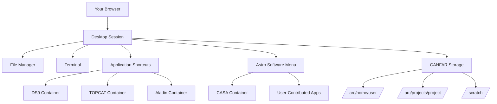

# Desktop Sessions

**Linux graphical environment in your browser with astronomy software**

!!! abstract "🎯 What You'll Learn"
    - How to launch, connect, and configure desktop sessions
    - Available software and how to launch astronomy applications
    - Managing files and storage within desktop sessions
    - Tips for collaboration, performance, and troubleshooting

Desktop sessions on CANFAR provide a full Linux graphical environment directly in your browser, with access to CANFAR storage. Most astronomy software runs in dedicated containers on separate worker nodes and connects to your browser session using X11 protocols. This provides a familiar desktop experience for GUI applications and traditional workflows.

## 📋 Overview

Desktop sessions offer:

- **Full Linux desktop**: Accessed in your browser, with CANFAR storage integration
- **Multi-application workflow**: Run multiple programs and containers simultaneously
- **Traditional interfaces**: Use graphical astronomy software and desktop tools
- **File management**: Visual file browser and management tools
- **Session persistence**: Resume work exactly where you left off

### Common Use Cases

- **Running astronomy software in containers**: DS9, Aladin, TOPCAT, CASA, etc.
- **Multi-step workflows**: Combine several applications in sequence
- **Teaching and demonstrations**: Share desktop for educational purposes
- **Legacy software**: Applications requiring a desktop environment
- **Visual file management**: Organise data with graphical tools

### How Desktop Sessions Work



**Desktop Runtime**: Provides the graphical environment in your browser
**Application Containers**: Most astronomy software runs in separate containers
**X11 Forwarding**: Applications display through the desktop session
**Storage Integration**: Direct access to CANFAR filesystems

## 🚀 Creating a Desktop Session

### Step 1: Select Session Type and Name

From the Science Portal dashboard, click the **plus sign (+)** to create a new session, then select **desktop** as your session type.

Choose a descriptive session name to help you identify it later:

**Good session names:**
- `data-reduction`
- `teaching-session`
- `multi-instrument-analysis`
- `collaborative-work`

### Step 2: Configure Resources

Desktop sessions use the default container and resource allocation. For most desktop work, the default settings are appropriate.

**Resource Guidelines:**
- **Memory**: 16GB is typically sufficient for most desktop workflows
- **CPU**: 2-4 cores handle most desktop applications well
- **Storage**: Use persistent storage in `/arc/` for important work

### Step 3: Launch Session

Click the **Launch** button and wait for your session to initialise:

Desktop sessions may take slightly longer to start than other session types as they need to set up the full graphical environment.

Your session will appear on the Science Portal dashboard.

!!! note "Connection Timing"
    Sometimes it takes a few seconds for the session link to work properly. If you see a "Bad gateway" error, wait a moment and try again.

## 🖥️ Connecting to Your Desktop

### Initial Connection

Click the desktop icon to access the connection page, then click **Connect** to access your desktop environment.

### Desktop Environment

When you connect, you'll see a full Linux desktop in your browser with the following features:

#### Key Desktop Features

- **Taskbar**: Application launcher and system controls at bottom
- **File Manager**: Browse CANFAR storage and manage files
- **Terminal**: Command-line access for advanced operations
- **Application Shortcuts**: Quick launch icons for common tools
- **System Menu**: Access to additional applications and settings

### Session Persistence

When your session becomes inactive, you'll be returned to the connection page. Click **Connect** again to resume exactly where you left off - all your applications and work remain open.

**Session Persistence Features:**
- Open applications remain running
- File locations and window positions preserved
- Terminal sessions maintain history
- Application states saved automatically

## 🛠️ Available Software

### Desktop Architecture

The desktop session provides access to astronomy software in two main ways:

#### 1. Desktop Shortcuts

Quick access icons available directly on the desktop:
- **DS9**: FITS image viewer and analysis
- **Aladin**: Interactive sky atlas and visualisation
- **TOPCAT**: Tool for Operations on Catalogues And Tables
- **Firefox**: Web browser for documentation and online tools

#### 2. Astro Software Menu

Access CANFAR-supported and user-contributed astronomy containers:

1. Click **Applications** menu in the taskbar
2. Select **Astro Software** to browse available containers
3. Choose your desired application to launch in a dedicated container

#### Available Applications

| Application | Type | Best For |
|-------------|------|----------|
| **DS9** | Image Viewer | FITS file display, region analysis |
| **Aladin** | Sky Atlas | Multi-survey visualisation, catalog overlay |
| **TOPCAT** | Table Tool | Catalogue analysis, cross-matching |
| **CASA** | Radio Astronomy | Interferometry data reduction |
| **astroml** | Analysis | python software stack for astronomy and ML |

### Native vs Container Applications

**Native Applications** (few):
- Basic file manager and terminal
- Simple text editors
- System utilities

**Container Applications** (most astronomy software):
- Run in dedicated containers on worker nodes
- Connect via X11 forwarding to your desktop
- Provide full functionality with isolated environments
- Include DS9, CASA, TOPCAT, Aladin, and contributed applications

#### CVMFS Software Repositories

In addition to containerized applications, you can access a wide range of scientific software via the **CVMFS** repositories mounted at `/cvmfs/`.

See the **[Software Repositories (CVMFS)](../cvmfs.md)** guide for more information and examples.

!!! important "Application Launch Method"
    You cannot start astronomy applications by simply running commands like `ds9 &` in a terminal. These applications must be launched through desktop shortcuts or the Astro Software menu, as they run in separate containers.

## 🧭 Working with Applications

### Launching Applications

#### Method 1: Desktop Shortcuts

Click the shortcut icon on the desktop for immediate access to:
- DS9 (FITS viewer)
- Aladin (sky atlas)
- TOPCAT (table analysis)
- Firefox (web browser)

#### Method 2: Astro Software Menu

1. Click **Applications** in the taskbar
2. Navigate to **Astro Software**
3. Select the application or container you need
4. Application launches in a new window

#### Method 3: File Association

- Double-click FITS files to open in DS9 (if available)
- Right-click files for "Open with" options
- File manager remembers your preferred applications

### Example Multi-Application Workflow

**Optical Astronomy Analysis:**

1. **File Management**: Organise data using the graphical file manager
2. **Image Display**: Open FITS files in DS9 for visual inspection
3. **Catalogue Analysis**: Load source lists in TOPCAT for analysis
4. **Cross-matching**: Use TOPCAT to cross-match with online catalogues
5. **Documentation**: Use Firefox to access documentation and references
6. **Scripting**: Open terminal for command-line operations as needed

### CASA Desktop Usage

To use CASA with its graphical interface:

1. Launch CASA from the **Astro Software** menu
2. Start CASA in the terminal by typing either `casa` or `casa --pipeline` as appropriate. 
3. Run CASA tasks as usual via command line or scripts (e.g., calibration or imaging). 
4. Access CASA's plotting and visualization tools (e.g., plotms or interactive clean).

## 🔧 Desktop Session Features

### Copy & Paste Between Containers

Since different containers may run on separate remote computers, text transfer between applications requires the **Clipboard** application.

#### Accessing the Clipboard

1. **Click the arrow** at the far left of the desktop taskbar
2. **Find "Clipboard"** in the application menu (middle of list)
3. **Click to open** the Clipboard application

#### Using the Clipboard for Text Transfer

The Clipboard functions as an intermediary for text transfer:

**Transfer Process:**

1. **Copy text**: Highlight text in source application, use `Ctrl+Shift+C`
2. **Transfer to Clipboard**: Text appears in the Clipboard application
3. **Select in Clipboard**: Highlight the text and copy with `Ctrl+Shift+C`
4. **Paste to target**: Click in destination application, use `Ctrl+Shift+V`

!!! tip "Keyboard Shortcuts"
    - **Copy**: `Ctrl+Shift+C`
    - **Paste**: `Ctrl+Shift+V`
    - These shortcuts work consistently across desktop containers

### Font Size Adjustment

Desktop containers support adjustable font sizes for better readability:

#### Changing Terminal Font Size

1. **Access font menu**: Hold `Ctrl` and right-click in a terminal window
2. **Select size**: Choose from Small, Medium, or Large options
3. **Apply immediately**: Font changes take effect instantly

**Compatible Applications:**
- Terminal windows
- CASA command-line interface
- Text-based applications

!!! note "Font Persistence"
    Font size changes apply only to the current session. You'll need to readjust when starting new sessions.

## 💾 File Management

### Storage Access

Your desktop session provides access to all CANFAR storage systems:

```bash
/arc/home/[user]/           # Personal persistent storage (10GB)
/arc/projects/[project]/    # Shared project storage
/scratch/                   # Temporary high-speed storage
```

### File Operations

Use the graphical file manager for:

- **Visual browsing**: Navigate directories with point-and-click
- **Drag-and-drop**: Move files between directories easily
- **Preview**: View image thumbnails and file properties
- **Batch operations**: Select multiple files for operations
- **Permissions**: Set file and directory permissions graphically

### File Transfer

**Small Files**: Drag and drop from your local computer to the file manager
**Large Files**: Use [data transfer methods](../storage/transfers.md)
**Between Sessions**: Files in `/arc/` are accessible from all session types

!!! warning "Persistence Reminder"
    Save important work to `/arc/projects/` or `/arc/home/`. Files in `/scratch/` will not persist after the session ends.

## 🤝 Collaboration and Sharing

### Session Sharing

Desktop sessions can be shared for collaborative work:

1. **Copy session URL** from browser address bar
2. **Share with team members** who have CANFAR accounts
3. **Coordinate activities** to avoid conflicts
4. **Use shared storage** in `/arc/projects/[project]/` for collaboration

### Collaborative Workflows

**Teaching and Training:**
- Share desktop session URL with students
- Demonstrate software usage in real-time
- Students can follow along with same tools

**Team Analysis:**
- Multiple researchers access same desktop
- Share applications and data simultaneously
- Coordinate complex multi-step analyses

### Best Practices for Collaboration

- **Communicate clearly** about who is controlling what
- **Use shared storage** for data that everyone needs to access
- **Plan ahead** for resource-intensive operations
- **Save work frequently** to avoid conflicts

